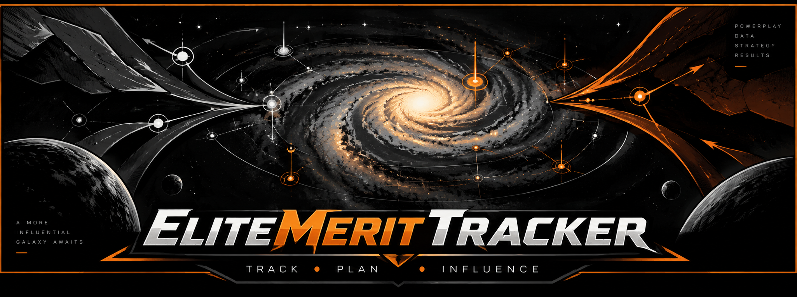
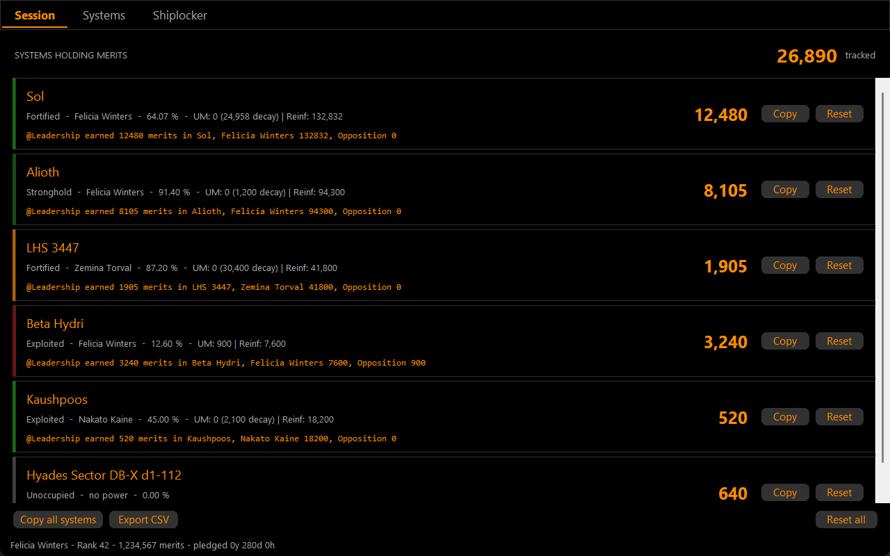
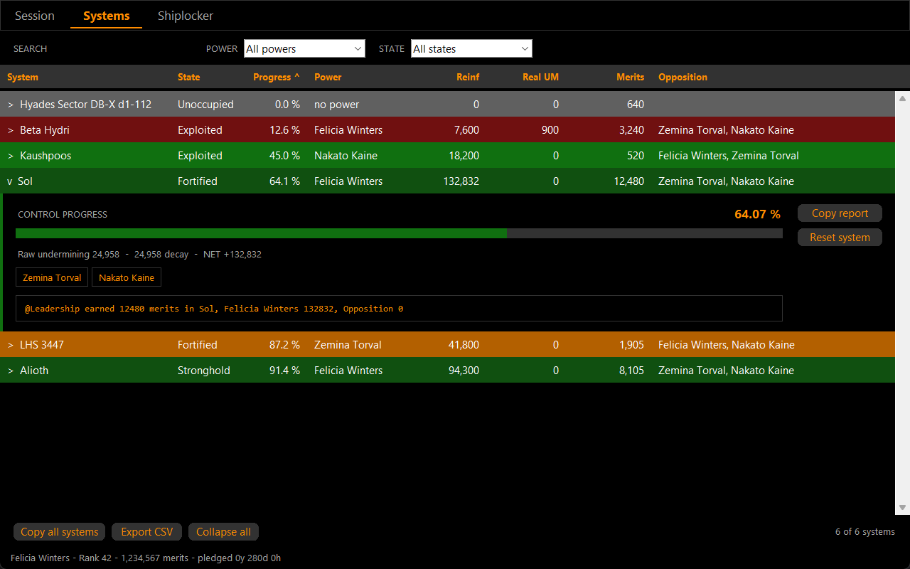
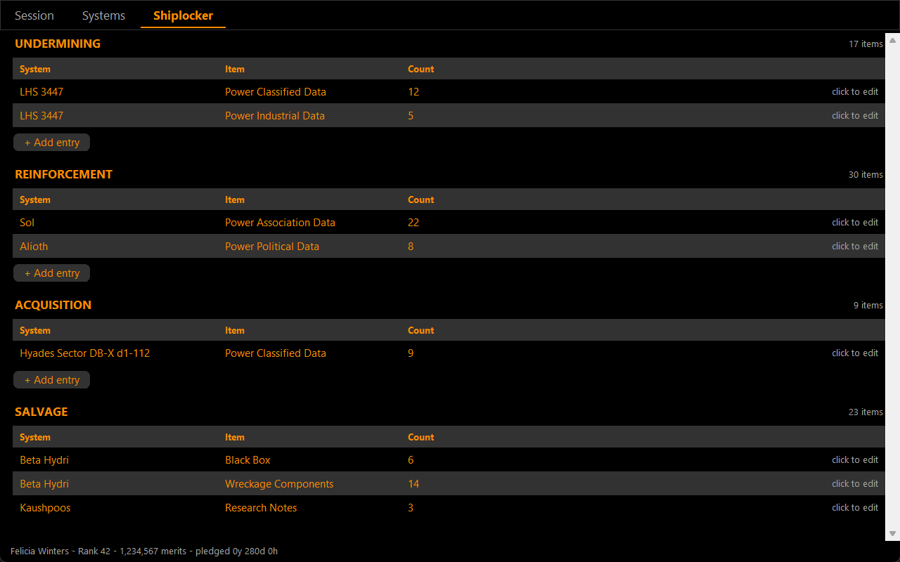

# EliteMeritTracker

EDMC plugin that tracks Powerplay 2.0 merits in Elite Dangerous.

It reads the journal as you play, credits merits to the system that earned them,
and keeps the lot in a SQLite database so nothing is lost between sessions.

## The Overview window

One window, three tabs. Everything below is the real window, drawn with example
data.

### Session — what is waiting to be reported



Every system still holding merits, with the report line it would produce.
**Copy** puts that line on the clipboard, or posts it to Discord when a webhook
is set; **Reset** zeroes the system and forgets its credits in the ledger.

### Systems — everything tracked, side by side



Sort by any column header, filter by power, state or name. A row folds open in
place to show its control progress, the decay taken off undermining, the
opposition and the report text — without losing your place in the list.

Row colour is the system's standing, not the theme:

| Colour | Meaning |
|---|---|
| red | control progress under 20 % |
| green | 20–80 %, or a Stronghold at any progress above 80 % |
| orange | 80 % or more and not a Stronghold |
| grey | no controlling power |

### Shiplocker — the Powerplay bags and the salvage hold



The three data bags — undermining, reinforcement, acquisition — and salvage,
each attributed to the system it was picked up in. Click a row to correct a
count; **+ Add entry** puts one in by hand.

## What it tracks

- **Merits per system**, from `PowerplayMerits`, cargo hand-ins, on-foot data
  deliveries and salvage.
- **Reinforcement and undermining**, with cycle decay subtracted so the
  undermining figure is the one that actually counts.
- **Powerplay micro-resources** in the backpack, per system.
- **Your pledge** — power, rank, total merits, time pledged.

Merits are tracked as the delta of `TotalMerits`, not by summing `MeritsGained`.
Verified against 388 journals / 2732 events: delta tracking reproduces the
server total exactly, summing `MeritsGained` overcounts by 5.6 %. Duplicate
server awards are detected and unwound — see `emt_core/duplicate.py`.

## Features

- Session and total merit counters in the EDMC panel
- Sortable, filterable system table with in-place detail
- Discord webhook reports, with a configurable message template
- CSV export of every tracked system
- Auto-update from GitHub releases, stable or beta channel
- Follows EDMC's theme; the status colours stay readable on any of them

## Installation

1. Download the latest release from [Releases](https://github.com/Fumlop/EliteMeritTracker/releases)
2. Extract the ZIP into:
   ```
   %LOCALAPPDATA%\EDMarketConnector\plugins\EliteMeritTracker
   ```
3. Restart EDMC

### Updating

The plugin checks GitHub for new releases and offers a one-click update.

To update by hand: close EDMC, replace the plugin folder, restart. Your data is
not in the plugin folder (see below), so it survives either way.

## Where your data lives

```
%LOCALAPPDATA%\EliteMeritTracker\db\merittracker.db
```

Outside the plugin folder, on purpose: a reinstall replaces the plugin, and
nobody expects that to take their merit history with it.

| Table | Holds |
|---|---|
| `systems` | one row per system per commander, the whole record as JSON |
| `inventory` | the three data bags and salvage, per item and system |
| `meta` | the pledge, the commander name, the migration report |

Backups land in `db\backups\`, newest two kept, and are only written when the
database passes an integrity check and has rows in it.

### Coming from an older version

The JSON files under `data/` are imported once, automatically, the first time
you start a version with the database in it. A marker file, `db\migrate.done`,
stops it running again.

Nothing is deleted: `data\*.json` stays exactly where it is. If you ever want to
go back, remove the `db` folder and downgrade — the JSON is still there.

## Privacy

Everything stays on your machine. The only outbound traffic is the GitHub
version check and, if you configure one, your own Discord webhook.

## Development

```
python emt_tests/run_tests.py          # the suite, with coverage
python -m pytest emt_tests -o addopts=""   # the suite, without pytest-cov
python lab/shoot_overview.py           # redraw the screenshots above
```

The screenshots in this README are rendered from the real widget code by
`lab/shoot_overview.py`, with example data — never a commander's own.

See [structure.md](structure.md) for the module layout.

## Credits

Developed by [Fumlop](https://github.com/Fumlop)

## License

See [LICENSE](LICENSE) for details.
